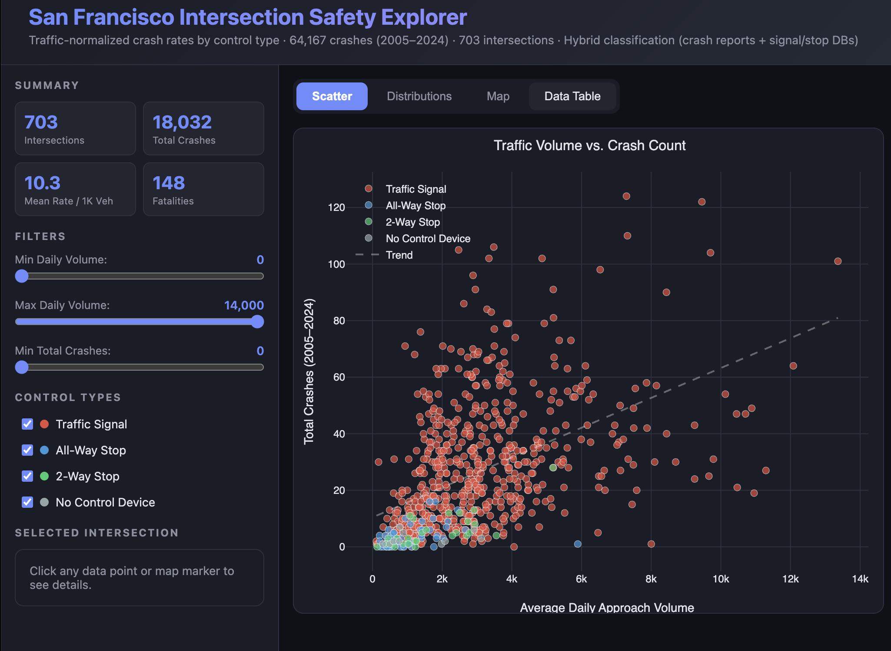

# SF Intersection Safety Explorer

Interactive analysis of crash rates at 703 San Francisco intersections, normalized by traffic volume and compared across traffic control types.

**[Live Demo](https://skywalkerswartz.github.io/sf-intersection-safety/)**



## Key Finding

Even after normalizing for traffic volume, **signalized intersections have crash rates 2-3x higher** than stop-sign-controlled intersections (Kruskal-Wallis H=141.48, p<0.000001). This likely reflects that signals are placed at the busiest, most complex intersections — the elevated rate persists even after volume normalization.

## Features

- **Interactive scatter, box, bar, and histogram charts** (Plotly.js) — hover/click for intersection details
- **Filterable map** (Leaflet.js with CARTO dark tiles) showing all 703 intersections
- **Sortable data table** with per-intersection crash rates
- **Dynamic sidebar filters** for volume range, crash count, and control type
- **Click-to-inspect** intersection detail panel

## Data Sources

| Dataset | Source | Records |
|---------|--------|---------|
| Traffic Crashes (2005-2024) | [SF Open Data (ubvf-ztfx)](https://data.sfgov.org/Public-Safety/Traffic-Crashes-Resulting-in-Injury/ubvf-ztfx) | ~64,000 |
| Traffic Signals | [SF Open Data (ybh5-27n2)](https://data.sfgov.org/Transportation/Traffic-Signals/ybh5-27n2) | ~1,500 |
| Stop Signs | [SF Open Data (4542-gpa3)](https://data.sfgov.org/Transportation/Stop-Signs/4542-gpa3) | ~23,000 |
| Intersection Traffic Counts | [SFMTA (2014-2022)](https://www.sfmta.com/reports/traffic-count-data) | ~1,200 |

All datasets are joined using San Francisco's **CNN (Centerline Network Number)**, a unique identifier for each intersection.

## Methodology

### Traffic-Normalized Crash Rate

The core metric is **crashes per 1,000 daily approach vehicles**:

```
crash_rate = (total_crashes / daily_approach_volume) * 1000
```

This normalizes for the fact that busier intersections naturally see more crashes.

### Hybrid Classification

Intersection control type is classified using a hybrid approach that cross-references crash report data with infrastructure databases:

1. If **>50%** of crashes at an intersection report `control_device = "Functioning"` → **Traffic Signal**
2. Else if the intersection CNN appears in the Traffic Signals database → **Traffic Signal**
3. If **>30%** of crashes report `control_device = "Stop Sign"` → classify by stop sign count
4. Else if CNN appears in the Stop Signs database → classify by stop sign count
   - 1-2 signs → **2-Way Stop**
   - 3+ signs → **All-Way Stop**
5. Otherwise → **No Control Device**

This hybrid approach is necessary because the Traffic Signals database is significantly incomplete, missing ~450 signalized intersections. The crash report `control_device` field provides a more reliable ground truth.

### Statistical Tests

- **Kruskal-Wallis H-test**: Non-parametric test for differences across all control types
- **Pairwise Mann-Whitney U tests**: Compare each pair of control types
- **Pearson and Spearman correlations**: Volume vs. crash count relationship

## Running the Analysis

### Prerequisites

```bash
pip install pandas numpy matplotlib seaborn scipy
```

### Download Data

```bash
./download_data.sh          # Downloads to data/ directory
# or
./download_data.sh mydata   # Downloads to custom directory
```

### Run Analysis

```bash
# Full analysis with charts and statistics
python3 analysis.py

# Custom directories
python3 analysis.py --data-dir mydata --output-dir results

# JSON only (for updating the web app)
python3 analysis.py --json-only
```

### Output

The analysis produces:
- `intersection_data.json` — Per-intersection data (used by the web app)
- `intersection_crash_rates.csv` — Full data table
- `summary_by_control_type.csv` — Summary statistics
- `fig1-fig4` PNG charts — Static visualizations

## Project Structure

```
sf-intersection-safety/
├── index.html              # Self-contained web app (~274KB, all data inlined)
├── analysis.py             # Python analysis script (hybrid classification)
├── download_data.sh        # Data download helper
├── README.md               # This file
└── data/                   # Raw CSV data (not committed, use download_data.sh)
```

## Architecture

The web app (`index.html`) is a single self-contained HTML file with:
- All 703 intersection records inlined as a JavaScript array
- Plotly.js and Leaflet.js loaded from CDN
- No server-side dependencies — works as a static file

This design means the app works on GitHub Pages (or any static host) with zero configuration.

## Contributing

1. Download the data: `./download_data.sh`
2. Modify `analysis.py` to change the analysis or classification logic
3. Run `python3 analysis.py --json-only` to regenerate the JSON
4. Update the `ALL_DATA` array in `index.html` with the new JSON
5. Open `index.html` in a browser to test

## License

MIT
